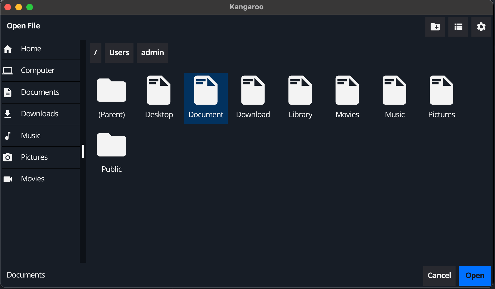

Kangaroo
===

Kangaroo try to make the process of creating a GUI for your command line tool easy
if your program take a file path as argument then you are at the right place.



## How to build

Inside the repository bsae folder run

```bash
go build .
```

## How to use

After building the GO project it will create a `kangaroo` file, just run it:

```bash
./kangaroo
```

## Config

You can edit the `config.ini` to fit your needs.
The `config.ini` must stay in the same folder as the binary file (ex:. `kangaroo`).

## Thanks

I hope this project will save you time and that we can all make it better for each other.

Happy coding!
